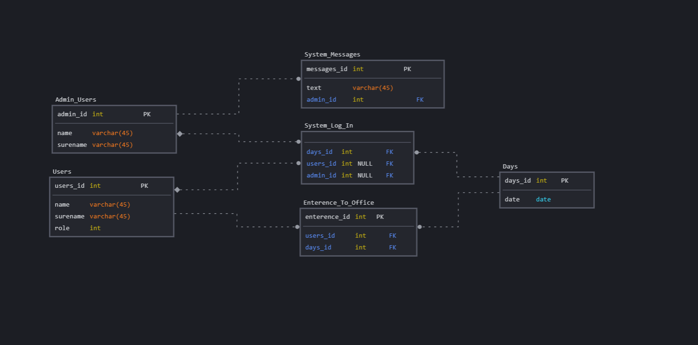
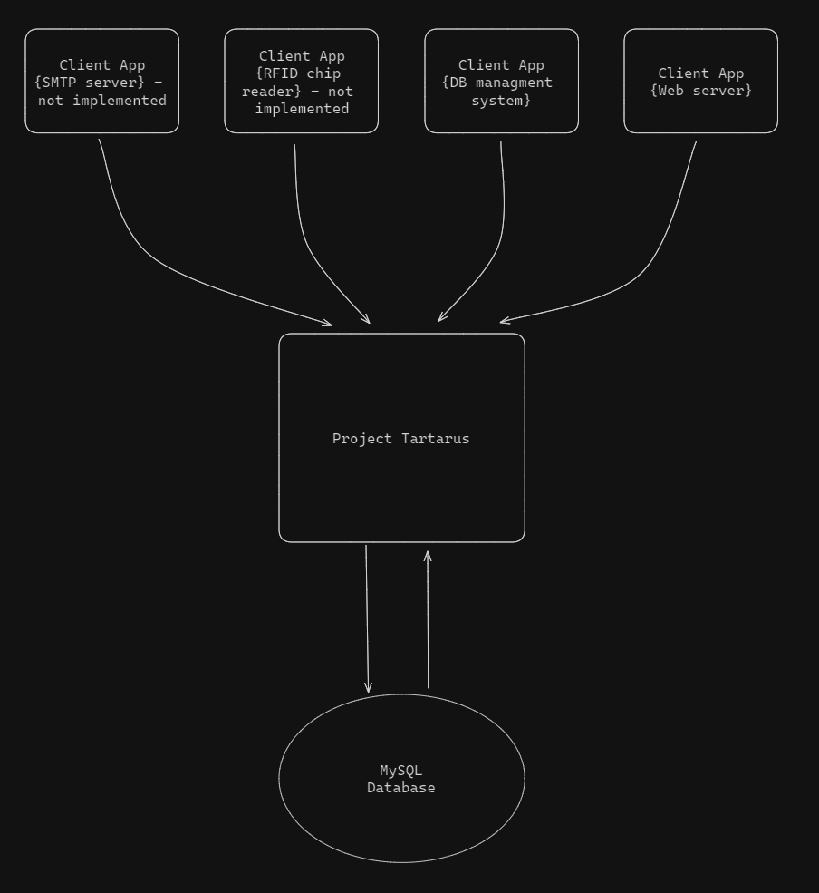

# ProjectTartarus

**Disclaimer:** This project is a final project created by Anton Kalashnikov for Střední průmyslová škola elektrotechnická, Praha 2,
Ječná 30's Computer Science course.
All rights are reserved by the creator, and unauthorized distribution or use of the project is prohibited.

A layer between clients and the database, <br>
ProjectTartarus contains a business rule engine that consolidates rules into one centralized location <br>
rather than scattering them across various applications. <br>
It simplifies database interactions, eliminating the need for direct queries; <br>
instead, users can utilize a specialized API format and transmit data through sockets. <br>

**Avaliable functions**:

* Automatic database setup
* Easy to read error logs
* Control using api
* Exception handling
* Business rules control
* Multiprocessing

## Description

* Made by: **Anton Kalashnikov**
* School: **SPSE Jecna**
* Contacts:
    * Email: kalashnikov004@gmail.com

This project serves as the final work for my Computer Science course. <br>
I aimed to develop a program functioning as a core for communicating with databases, <br>
thereby centralizing business logic in one location to alleviate users from managing it separately. <br>

Current vesrion: 0.6.5

## Table of Contents

* [Disclaimer](#projecttartarus)
* [Description](#description)
* [Table of contents](#table-of-contents)
* [Installation](#installation)
* [Usage](#usage)
* [Configuration](#configuration)
* [Contributing](#contributing)
* [License](#license)
* [Credits](#credits)
* [Tests](#tests)
* [Support](#support)
* [Versioning](#versioning)
* [Security](#security)
* [Dependencies](#dependencies)
* [Protocol](#protocol)
* [Example database](#example-database)
* [Flow chart and other information](#application-flow-chart-and-how-it-works)

## Installation

1) Download zip file or use git cmd: ``git clone https://github.com/Kalash004/ProjectTartarus.git``

## Usage

ProjectTartarus is designed to simplify the management of database interactions and business logic for your application.
Below are some guidelines on how to use the application effectively:

* Initialization:

  Before using ProjectTartarus, ensure that it is properly initialized within your application environment.
  This may involve setting up configuration files, establishing database connections, and importing necessary modules.

* Integration:

  Integrate ProjectTartarus into your application codebase by importing the relevant modules or packages.
  Ensure that your application's components, such as user interfaces or backend services, utilize ProjectTartarus for database
  interactions and business logic processing.

* API Usage:

  Familiarize yourself with ProjectTartarus's API protocol for interacting with the database and executing business logic.
  Use the provided API methods and functions to perform CRUD (Create, Read, Update, Delete) operations on your database tables.
  Utilize ProjectTartarus's business rule engine to encapsulate and execute complex business logic within your application.

    * Error Handling:

      Implement error handling mechanisms within your application to gracefully manage exceptions or errors that may arise during
      database
      interactions or business logic execution.
      If during execution of your request an exception arises, database will send back a status:22. More about it
      in [protocol](#protocol)
      **All the erros that happened are writen into ProjectTartarus/logs/logs.log**

* Use Case: Building Access Control System Integration
* Actors:
    * User: A person who wants to access a building.
    * Building Administrator: Responsible for managing access permissions and monitoring building access.
* Preconditions:
    1) The building is equipped with a card reader system.
    2) The ProjectTartarus application is installed and configured to communicate with the card reader system and the database.
* Main Flow:
    1) User Presents Card: The user approaches the entrance of the building and presents their access card to the card reader system.

    2) Card Authentication: The card reader system scans the access card and verifies its authenticity.

    3) Data Transmission: Upon successful authentication, the card reader system sends the access event data to the ProjectTartarus
       application.

    4) Data Processing: ProjectTartarus receives the access event data and processes it according to predefined business rules.

    5) Database Interaction: ProjectTartarus interacts with the database to store the access event data securely.

    6) Logging: ProjectTartarus logs the access event along with relevant details such as user ID, timestamp, and access location.

    7) Feedback to User:
        * If access is granted, the card reader system activates the door mechanism to allow the user to enter the
          building.
        * If access is denied, appropriate feedback is provided to the user.

* Postconditions:
    1) The access event data is successfully stored in the database.
    2) The building administrator can review access logs and manage access permissions using the ProjectTartarus application.
* Alternative Flow:
    1) Access Denied: If the card authentication fails, the card reader system denies access and logs the unsuccessful access attempt.
    2) ProjectTartarus records the event in the database with a corresponding access denied status.

## Configuration

1) Configure api server at ProjectTartarus/config/api_server.json:

    * "api_server_running_port": port you want to use for the api to be avaliable at
    * "api_server_address": server address you want to use for the api to be avaliabel at (example:"127.0.0.1" - this is local host ip)
    * "connection_life_sec": maximum seconds the connection is going to be alive - defualt 5 (after what time should the api
      connection close)
    * "max_connections_allowed":  maximum amount of connecitons allowed to connect to the api server - default 5 (stops accepting new
      after all connections are used)

2) Configure allowed api keys at ProjectTartarus/config/auth_conf.json:
   "api_keys": ```["place","each","api-key","separated like this"]```

    - you can use multiple api keys, to update them you need to restart the app

3) Configure database conneciton at ProjectTartarus/config/database_connection_config.json:
    * username: "YourDatabaseUsername" - The username used to authenticate with the database server.
    * password: "YourDatabasePassword" - The password used to authenticate with the database server.
    * database_host: "YourDatabaseHost" - The host address where the database server is located.
    * port: YourPortNumber - The port number on which the database server is listening.
    * database_name: "YourDatabaseName" - The name of the database to connect to.
    * char_set: "YourCharacterSet" - The character set encoding to be used for data stored in the database.
4) Configure business rules you want the engine to use:
    * Place the .py files into ProjectTartarus/src/program_layers/business_layer/rules_loader/rules/
        * File name and class name must have same name (example: file - Rule_NameCantBeAnton.py | class - class Rule_NameCantBeAnton:)
        * Use example rules as a format a rule should be developed under
    * Configure config/rules_to_load.json:
        * Place file/class names like shown below
   ```
    "rules": [
    "Rule_NameCantBeTony",
    "Rule_NameCantBeDona",
    "Rule_NameCantBeAnton",
    "Rule_OfficeSurnameCantBeKalashnikov"]
   ```
5) Setup your database tables using SimpleSQL ORM format at src/program_layers/database_layer/tables/tables.py
    * Get inspired by an example schema
    * SimpleSQL was created and is maintained by me @Anton Kalashnikov.

6) If everything was setup correctly you can run the app using python enterpreter:
    1) Open comand line
    2) Find ProjectTartarus directory
    3) Use command: python TartarusMain.py

    * If you see Running on {ip address you configured}:{port you configured} the app runs

## Contributing

Currently no contribution is supported or allowed. For more information about the project and contribution contact me via my
[contacts](#description)

## License

All Rights Reserved © Anton Kalashnikov (Střední průmyslová škola elektrotechnická, Praha 2, Ječná 30)

## Credits

* Whole project except mysql connector is maid by me

1) Python pip packages:
    * pip install mysql-connector-python - myslq connector
2) My libraries:
    * SimpleSQL - Simple ORM made in python for python

## Tests

ProjectTartarus includes three unit tests that can be executed as Python unit tests. These tests are designed to validate the
functionality of key components within the application and ensure that they perform as expected. The unit tests cover the following
aspects of the application:

* Database Interaction Test - can be found ProjectTartarus/src/program_layers/database_layer/SimpleSQL/tests:

This unit test verifies the correct interaction between ProjectTartarus and the database. It validates the functionality of database
connection, CRUD operations, and data retrieval processes.

* Business Logic Test - ProjectTartarus/tests:

The business logic unit test focuses on testing the execution of business rules and logic implemented within ProjectTartarus. It
ensures that the application processes data and performs calculations accurately according to predefined rules.
Test cases include scenarios that evaluate various business rules. Currently checking disallowed names rules

* Arguments parser test - ProjectTartarus/tests
* Request parser test - ProjectTartarus/tests

## Support

For support use my [contacts](#description)

## Versioning

Semantic versioning

## Security

Dont forget to add api keys as said in [configuration steps](#configuration)

## Dependencies

* Python3.10+
* My sql connector - mysql-connector-python

## Protocol

Check ProjectTartarus/docs/protocol.md

## Example database



* admin_users
* office_users
* days
* system_messages
* system_log_ins
* enterences_to_office

All of the tables can be accessed

## Application flow chart and how it works




Aplication was developed with SOLID principles in mind. <br>
**Used architectural pattern:**

* Three layer

**Used design patterns:**

* Creational:
    * Singleton
    * Factory

* Structural:
    * Decorator
    * Facade
    * Plugin

* Behavioral:
    * Chain of responsibility
    * Command
    * State
    * Startegy 
  